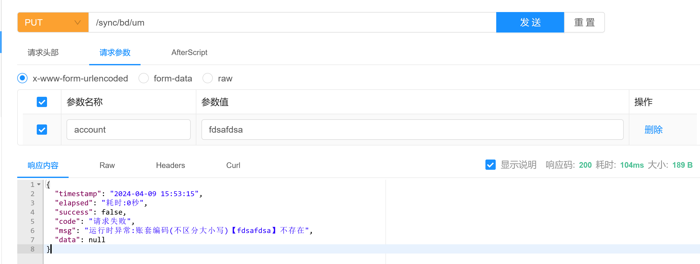

# erxing-exception

>　**道虽迩，不行不至；事虽小，不为不成**
> 
>　　　　　　　　　　　　　　　──《荀子·修身》

## 一、背景介绍
在开发过程中，经常需要对数据进行判断与校验（密码错误，账号不存在），不通过则需要抛出异常。
```java
    User user = userDao.findUserByUsername(username);
    if(null==user){
        throw new RuntimeException(username+"不存在");
    }
```
正常情况下是需要用`if`或者`try-catch`，然后`throw`异常。代码本身没问题，但写多了以后会很烦，代码也不优雅。
网上很多优雅写代码的教程，其中利用`枚举+断言`就可以解决此问题。
```java
    User user = userDao.findUserByUsername(username);
    //网上常见教程效果  
    Assert.isNotNull(user);
```
网上大部分教程,只做到了通过断言,减少if的代码,但没有自定义错误说明的功能。
本项目是参考`枚举+断言`的思路，增加自定义错误功能，并且封装`枚举+断言`必须的代码，使用时仅需扩展自定义错误。

## 二、功能介绍
1. 创建自定义异常`ErxingException`；
2. 支持自定义错误枚举扩展；
3. 重写Assert类，支持Assert后自定义异常文本输出；
4. 引入`@RestControllerAdvice`,自动捕获异常及处理；
5. 封装通用返回值对象（所有项目均可使用）；
```java
public class R<T> implements Serializable {

    /**
     * 返回时间
     */
    @JsonFormat(pattern = "yyyy-MM-dd HH:mm:ss", timezone = "GMT+8")
    private LocalDateTime timestamp;
    /**
     * 消耗时间
     */
    private String elapsed;
    /**
     * 接口成功标志
     */
    private boolean success;
    /**
     * 错误代码
     */
    private String code;
    /**
     * 错误提示，用户可阅读
     */
    private String msg;
    /**
     * 返回数据
     */
    private T data;

    //已封装静态方法如下
    public static R<Void> ok();
    public static <T> R<T> ok(T data) ;

    public static <T> R<T> ok(String msg,T data);
    public static R<Void> fail() ;
    public static  <T> R<T> fail(T t) ;
    public static R<Void> fail(String msg);
    public static R<Void> fail(String code, String msg);

    /**
     * 如果返回对象为集合，则 msg =请求成功,数据共{0}行
     * @param data
     * @return
     * @param <T>
     */
    public static <T> R<Collection<T>> okList(Collection<T> data) {
        return R.ok(MessageFormat.format(SUCCESS_LIST_MSG,(null==data?0:data.size())),data);
    }
}

```


## 三、使用方法

### 第一步 引入依赖
```xml
<dependency>
    <groupId>io.github.xuming9</groupId>
    <artifactId>erxing-less-if</artifactId>
    <version>${erxing.version}</version>
</dependency>
```
### 第二步 创建自定义错误枚举
自定义枚举必须实现接口`cn.xuming.erxing.lessif.core.ErxingExceptionAssert`

示例:

后续自定义枚举
```java

@AllArgsConstructor
@Getter
public enum CustomExceptionAssertEnum implements ErxingExceptionAssert {
    
    ACCOUNT_DB_NOT_EXISTS("E10001","账套编码(不区分大小写)【{0}】不存在"),
    ;

    private final String code;
    private final String message;

}

```

### 第三步 枚举使用方式
将`if(null==)`替换为`ACCOUNT_DB_NOT_EXISTS.isNotNull`

**示例:**
```java

@RestController
@RequestMapping("/sync/")
@Slf4j
@RequiredArgsConstructor
public class SyncBaseDataController {

    private final KisBaseDataService kisBaseDataService;

    /**
     * 201-计量单位
     * @param account 账套名称
     *
     */
    @ApiOperationSupport(order = 201)
    @PutMapping("um")
    public R<String> um(@RequestParam(name = "account", required = false) String account) {
        AccountDb accountDb = AccountDb.toEnum(account);
        ACCOUNT_DB_NOT_EXISTS.isNotNull(accountDb, account);
        return R.ok(kisBaseDataService.um(accountDb));
    }
}
```
返回值:



### 第四步 返回值修改(手动加入代码)
因没个项目的路径和异常捕获方法不同,甚至response不同,没有在本项目加入默认返回值修改逻辑。
如有需要，可复制以下代码
注意：需要修改`controller`路径，返回值`R`为本包的`R`对象

**AOP代码：**
```java

@Aspect
@Component
@Slf4j
@RequiredArgsConstructor
public class ControllerAspect {

    @Around("execution(* cn.xuming.erp.jdekis.controller.*.*(..)))")
    public Object injectResponse(ProceedingJoinPoint joinPoint) throws Throwable {
        return modifyReturnValue(joinPoint);

    }

    @Around(" @annotation(org.springframework.web.bind.annotation.ExceptionHandler) ")
    public Object injectException(ProceedingJoinPoint joinPoint) throws Throwable {
        return modifyReturnValue(joinPoint);

    }

    private Object modifyReturnValue(ProceedingJoinPoint joinPoint) throws Throwable {
        long start = System.currentTimeMillis();
        Object result = joinPoint.proceed();
        if (result instanceof R) {
            R<?> r = (R<?>) result;
            r.setTimestamp(LocalDateTime.now());
            r.setElapsed("耗时:" + DateUtils.betweenTime(start));
            // 修改返回值并返回
            return r;
        }
        return result;
    }
}
```

## 其他注意事项
本项目依赖了2个包，`spring-boot-starter-web`和`lombok`,在打包时做了provided处理,因此如果您的项目没有这2个包,需要手动依赖
